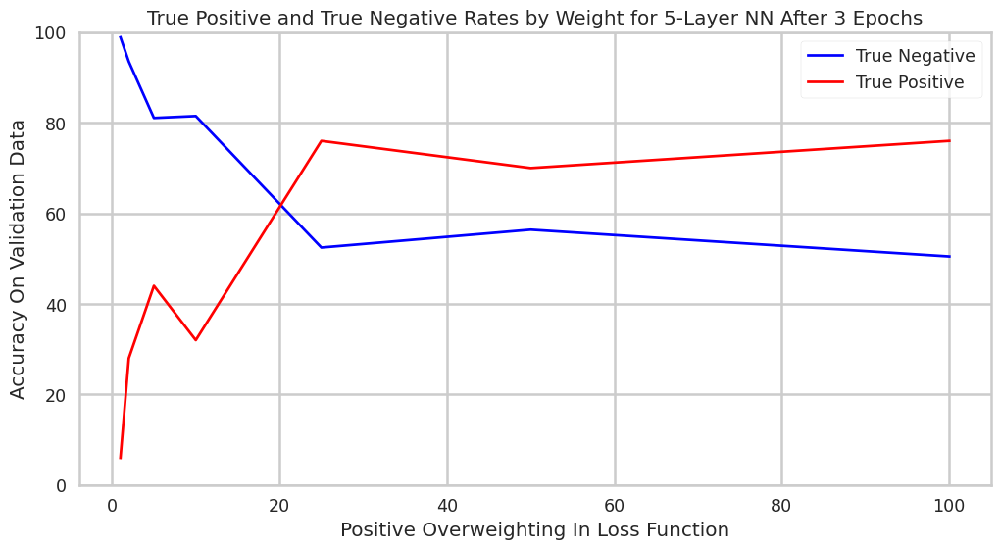
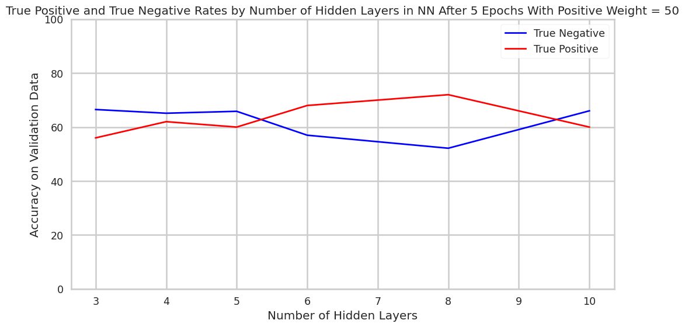
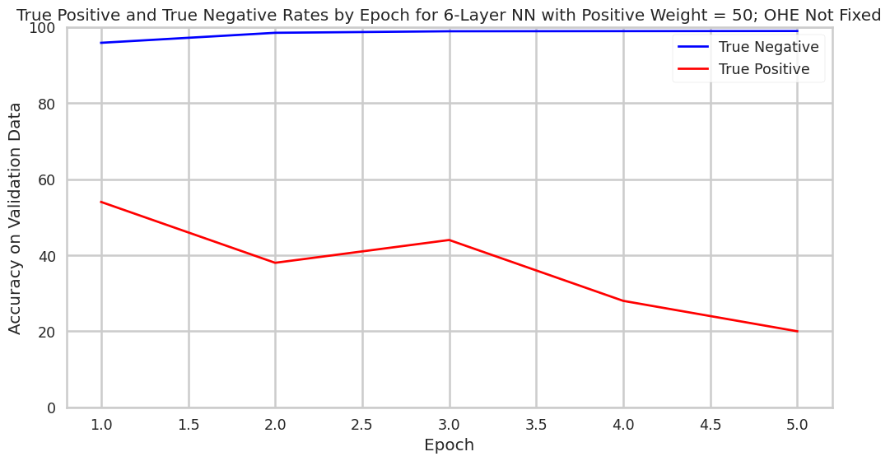
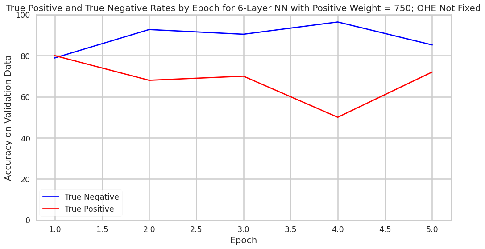

# Paycheck Protection Program (PPP) Loan Fraud Detection

## Authors
Max Baum, Arsh Chhabra, Cameron Hatler, Viren Jain

## Abstract

Paycheck Protection Program (PPP) loans were issued during the pandemic to help small businesses, but there was rampant fraud associated  with the program. We use a PPP loan dataset that identifies loans confirmed by the justice system to have been issued under fraudulent circumstances. We construct the architecture of a fully connected feed forward neural network to classify PPP loans for fraud, producing synthetic training data and using a weighted cross entropy loss function to account for class imbalances, ultimately allowing a neural network to identify fraud based upon loan attributes. We investigate neural network based anomaly detection as an alternative approach to detect fraud in this dataset, however we were unable to apply anomaly detection for a variety of reasons. For the classical neural network model, we were able to achieve acceptable accuracies that could enable increased efficiencies in fraud identification casework. 

## Introduction

The U.S. Federal Government disbursed nearly $700 billion in PPP stimulus in 2020, to counteract the economic downturn caused by the COVID crisis. Unfortunately, it is estimated that roughly 10% of the loans were potentially issued to fraudulent recipients, accounting for roughly $64b. Roughly $30b of potentially fraudulent PPP loans remains outstanding. 

In times of growing U.S. Federal Government deficit, alongside increased scrutiny from taxpayers regarding use of government funds, the status quo of the PPP is highly concerning. It also calls into question what better controls could be implemented, to either prevent fraud outright or to improve the success-rate of fund recovery casework. 

This project is focused on investigating what neural network based approaches can be leveraged to predict fraudulence of loans based upon data released under a Freedom of Information Act (FOIA) request, which required the Small Business Administration (SBA) to publicly disclose data regarding PPP loans issued [^1]. The project is imperfect, and navigates many challenges including extreme class imbalance and incomprehensive confirmation of loan fraud. The project centers around an expanded version of DANB91's PPP Fraud Dataset [^2], that draws from other developments in the court system. The dataset is incomplete, but nonetheless provides some color where none previously existed. Further, while a variety of NN based approaches can be used to address some of these outstanding issues, it must be acknowledged that no approach can ever fully correct for bad data.

Overall, this project does not seek to revolutionize or even directly inform an government decision-making in the issuance of small business loans. Rather, it seems to demonstrate the promise of increasing data-driven governance, and to confirm the existence of structure in data that can be used to guide better decision making. $60 billion is a heck of a lot of money to be lost to fraudulent activity, in times when American taxpayers are increasingly squeezed financially. One would hope that failures of this magnitude could be better derisked against moving forward.

## Ethical Sweep

There is significant merit in attempting to reduce fraud in government programs like the PPP. Governments operate with limited resources funded by a finite tax base, and it is important that these resources are used responsibly and reach their intended recipients. Our project, while classroom-bound, aims to explore whether machine learning can assist in identifying potentially fraudulent loans — a task that holds real-world value.

That said, there are limitations and risks inherent to this work. The accuracy of a simple, non-ML rule-based approach is likely to be low given the number and complexity of variables involved, as well as the nuanced relationships between them. Machine learning, despite its promise, also comes with risks — especially when the ground truth is uncertain. A key challenge we face is that the majority of our dataset consists of loans that have not been confirmed either way; only a very small subset has been labeled as fraudulent through the justice system. This creates a problem of label scarcity and possible bias, as loans that have not yet been investigated might be wrongfully treated as negatives. Additionally, we acknowledge potential bias in the way this dataset was assembled and processed, which may affect our model’s fairness and reliability.

We also recognize that our team, like most student groups at the 5Cs, is not demographically representative of the broader U.S. population. As such, our perspectives are inherently limited. Throughout the project, we aim to counterbalance this by engaging in frequent and transparent team discussions, especially around mistakes, uncertainties, and assumptions. Code and outputs will be reviewed by multiple team members to ensure accountability, and data will be spot-checked as time allows. Though our outputs are unlikely to leave the classroom, we believe in treating this project with the seriousness it deserves.

In terms of privacy, all data used in this project is publicly available. Given the nature of the analysis, we believe there is minimal risk of infringing upon individuals' privacy or anonymity. However, we remain conscious of the ethical line between analysis and accusation. A flagged loan is not proof of fraud — only the justice system has the authority to make that determination. Our model is a retrospective tool, and should it be used in any future capacity, it would be most appropriate as part of a triage process rather than a definitive arbiter.

Lastly, we do not currently know if the model will perform differently across sub-groups, nor are we sure what constitutes a meaningful "sub-group" in the context of this data, given its limited granularity. Misinterpretations of the model’s outputs are a real concern and must be addressed through clear communication of its capabilities, limitations, and the fact that this is an exploratory academic project — not an instrument of policy or prosecution.

## Related Work

Our project applies neural networks to detect fraudulent PPP loans, leveraging insights from Zhan and Yin (2018)[^3] and Awotunde et al. (2022)[^4]. Zhan and Yin propose a knowledge graph-based fraud detection system that constructs borrower networks from call history data. Differing from traditional models that would gather 100s of features, their model captures hidden fraud patterns such as borrowers sharing suspicious contacts—making it harder for fraudsters to evade detection. This method suggests that graph-based representations could enhance our model’s ability to detect anomalies. 

Awotunde et al. (2022) employs various machine learning models including Neural Networks for loan fraud detection, achieving 98% accuracy on a bank loan dataset. The findings suggest that ANNs outperform traditional models like decision trees and SVMs in identifying fraudulent transactions. By integrating these approaches, our project could explore graph-enhanced neural networks for fraud detection, improving classification accuracy despite limited labeled fraud cases. The combination of graphs and ANN-based classification offers a solution to identifying fraudulent loans.

We also note Anuradha (2024) performs neural network based fraud detection specifically on PPP loan fraud data. Anuradha achieves exceptionally high accuracy in their model, though their exact approach to producing and assessing this model is unclear [^5].

We face a problem in our dataset of having <250 data points being for confirmed fraud and >950,000 data points for other which we cannot classify as being non fraudulent. Hence, we have the idea of using anomaly detection via neural networks to hopefully train a model that can learn what fraud looks like and learn the class of fraudulent loans (or similarly the class of non fraud loans) and detect anomalies to detect things that do not belong to the desired class. So we have started to explore the areas of one class neural networks for anomaly detection as a result. We looked at two papers in this area: Anomaly Detection using One-Class Neural Networks by Chalapathy, et al. (2018)[^6] and Deep One-Class Classification by Ruff, et al. (2018) [^7]. Both of these papers provide useful insights into how neural networks can be optimized for anomaly detection. OC-NN’s ability to refine feature extraction for anomaly detection and Deep SVDD’s structured approach provide a useful theoretic background to our project which we hope to explore further. By leveraging these ideas we aim to develop a neural network that can generalize well even with the limited availability of confirmed fraud cases and solve a major problem present in our dataset.

By leveraging the flexibility of neural networks, we hope to find patterns in fraudulent applications of PPP loans in order to track down other suspicious borrowers. While our dataset can't be separated into true positive and negative cases of fraud, we have some true positive cases and many undetermined cases. By using anomaly detection, the model should give improved predictions of true positive and negative cases which will allow for easier application of the model. We will also aim to incorporate what various models have successfully done for different cases of fraud detection into our model. This work will help in fraud detection of PPP loans, saving money if it were incorporated, and will show how effective the combination of various neural network methods in this unique situation can be. 

## Methods

### Creating the Dataset

The dataset used in this report was compiled by Max Baum, Wonny Kwak, and Earn Wonghirundacha in a computational statistics course.

The dataset used in this project was produced with a multi step process to bridge two disparate datasets together. The first dataset was released by the Small Business Administration (SBA) under FOIA, and includes all PPP loans over $150K in value. This dataset was found on Kaggle (see Footnote 1 for link), though the SBA does release this data themselves [^8]. The Kaggle version of this dataset includes a separate sheet created by the author marking 100 instances of known fraud which were ultimately exploited. To find more cases of fraud in this PPP loan dataset, a tracker compiled by law firm Arnold & Porter of legal cases brought forth by the DOJ to address CARES Act fraud was referenced. This tracker included data and associated press releases for over 700 PPP-related lawsuits. While this data could not be mapped directly to fraudulent loans, it could be analyzed to identify connections to loans in the PPP loan dataset.

The two datasets use different identifiers for businesses and loans, so to join the two datasets, press releases identified by Arnold & Porter were scraped from the DOJ. This scraped data was then searched through to find business names in the SBA dataset. Ultimately, 176 distinct loans from the SBA dataset were matched to the Arnold and Porter tracker. When combined with pre-identified loans in the Kaggle dataset, a total of 248 loans were confirmed to be fraudulent. In the final dataset, the fraudulent loans were marked with a "1" in a new fraud column, while loans not found to be fraudulent were marked with a "0".

### Processing and Cleaning the Data

The initial dataset included 41 fields, of varying datatypes. To make this data utilizable by a neural network, significant processing had to be carried out.

Firstly, columns referring to the race, gender and ethnicity of the borrower were dropped from the dataset, as borrower-identity data was incomplete and we did not seek to interrogate the relation between borrower identity and likelihood of fraud. We do acknowledge that such relations may exist in the data, however, for a student run project doing so would be intractable. Relations between reported identity and fraud could be particularly interesting to analyze if there are differences in controls that exist between general SBA disbursement programs and disbursement for underresourced communities.   

Next, categorical data fields with small sets of possible values (or important granular information) were directly converted to one hot encoding. Other categorical data fields were also converted to one-hot encoding, but included possible encoding for only top ten values in the set, as well as a possible "other" encoding. How each field was encoded is indicated in the table below

| Column Name   | Encoding Process |
| -------- | ------- |
| NonProfit  | Direct Encoding    |
| Veteran | Direct Encoding     |
| BusinessType    | Direct Encoding    |
| ProjectState  | Direct Encoding  |
| BusinessAgeDescription | Direct Encoding     |
| LMIIndicator    | Direct Encoding    |
| HubzoneIndicator  | Direct Encoding    |
| RuralUrbanIndicator | Direct Encoding     |
| BorrowerState    | Direct Encoding   |
| ProcessingMethod  | Direct Encoding    |
| Franchise Name | Top 10     |
| OriginatingLender    | Top 10    |
| NAICSCode  | Top 10    |

After this encoding, the data was further cleaned, and any other fields that were not inherently numwerical was converted to a numerical equivalent. The data was then normalized.

### Addressing Class Imbalance

With only 248 confirmed cases of fraud, and over 900,000 loans that were not know to be fraud, the dataset used in this project was highly class imbalanced. To address this imbalance, we used a variety of balancing techniques. The first technique was synthetic minority over-sampling technique (SMOTE), a process that generates synthetic data by interpolating between nearest neighbors in the minority class [^9]. SMOTE was only used to balance the training data. We used the SMOTE package from imblearning [^10], creating a synthetic training dataset with an equal number of confirmed cases of fraud and non-confirmed fraud. Importantly, as SMOTE creates synthetic data through interpolation, synthetic data would be created with fields intended to represent one-hot encoding carrying values containing non-integers. To fix this, after running SMOTE, for each row in the dataset, the highest value in each set of one-hot encoded values would be converted to a 1, and all other values in that set converted to a 0.

The other balancing technique utilized in this project was weighting in cross entropy loss function. We set higher weights for misclassifying the minority class, such that calculated loss would be higher when misclassification of true positives occurred. Thus, the model would be oriented to maximize true-positive classification rate to avoid overlooking positives, ultimately coming at the cost of incorrectly classifying more negatives as positives.

### Building a Simple Fully Connected Neural Network 

For this project, we decided a traditional fully connected Neural Network (NN) was the best solution. The data we are working with doesn't have any spatial or temporal components, thus Convolution and Recurrent NNs wouldn't provide any significant benefits. Due to the class imbalance we were dealing with, we implemented a weighted Cross Entropy Loss which gave extra weight to misidentifying fraudulent loans. This is reasonable not only due to the class imbalance, but also because we consider it a lot more harmful for someone to get away with fraud than for us to misidentify an honest loan. We used a traditional Adam optimizer which has been shown to produce improved results compared to non-optimized neural networks. 

In choosing the depth and size of the hidden layers, we included 20 neurons in each hidden layer and varied the number of layers to use between 3 and 10. We decided 20 neurons in each hidden layer would be complex enough that the model can learn some patterns in the fraudulent cases without simply remembering the few cases of fraud that are verified to have occurred in our data. There isn't a good way to determine the optimal number of layers, so that is why we decided to vary this and check the accuracy as the number of layers changed. We did attempt it for other values of neurons and found 20 to be a reasonable value that avoided overfitting and provided sufficient flexibility. 

### Building an Anomaly Detection Focused Neural Network

As part of our exploration beyond standard supervised methods, we experimented with anomaly detection using one class neural networks (OC NN) (Chalapathy et al. 2018 [^4]). This method differed from several common approaches as it combines feature learning and anomaly detection in a single framework. The goal is to train a neural network that learns a compact representation of "normal" data and flags anything that falls outside this learned boundary as an anomaly. That is this technique essentially aims to create a decision boundary in high dimensional space within which everything is normal and outside of which is abnormal using a deep one class neural network. They do this by adapting the objective of one class SVMs into a neural setting.

We thought this method would work well for our case, since we have a small number of confirmed fraudulent PPP loans and a large set of unlabeled  loans which we couldn’t be certain were fraud, not fraud, or fraud in disguise. This seemed to align with the idea of anomaly detection with a one class setup. However, we quickly ran into problems. Unlike image datasets where "normal" is easy to define, our data is messy and complex. The amount of  noise in our dataset is much higher and there might be a really high bayes error. Most of the loans aren’t confirmed fraud, but they’re also not confirmed to be clean, which breaks the key assumption that the training data is purely from one class.

On the technical side, implementing OC NN for tabular data proved unstable. The architecture and optimization routines described in the paper were difficult to adapt to our high dimensional, one-hot encoded features, especially after SMOTE balancing. We also found that the loss function, designed to push all normal points toward a tight region, didn’t fit our case well. We noticed that "normal" loans might share a high degree of similarities with fraud. This was a large problem with our data labelling. The biggest takeaway was that deep anomaly detection (OC NN)assume clean class boundaries, which simply don’t exist in many real-world datasets like ours. It is hard to clearly define what “normal” (non fraudulent loans) and “non normal” (fraudulent) loans are because fraudulent bad actors have incentive to make the meta data appear as innocent as possible. The OC NN was not a method designed for adversarial labelling and instead was designed for much simpler processes with a natural bifurcation between “normal” and “non normal”. We still learnt a lot through this process and our attempts to understand the theory provided in this paper alongside ideate and attempt to wrangle the ideas they provide in a practical context.

To conclude although the theory behind one class neural nets and anomaly detection seems really cool, the model’s assumptions do not conform to the realities of the dataset, and hence it is not a suitable tool to employ here.

## Results

We received mixed results following our methodology, with our fully connected neural network performing decently, though no better than early results achieved using random forest models [^11]. We could not get our anomaly detection model to function correctly. 

### Tuning Hyper Parameters

| Parameter | Value |
| ------ | ------|
| Batch Size |  128  |
| Number of epochs |  Variable  |
| Layers and Layer Sizes |   Variable, typically 20 neurons per layer  |
| Loss function |     Cross Entropy Loss With Weights    |
| Optimization function |    Adam  |

We attempted tuning a variety of hyper parameters to assess how changing these hyper parameters may impact the accuracy of our model. Note, we consider accuracy as two seperate measures here. Specifically, we isolate true-positive and true-negative rates, as considering a blended accuracy rate would favor a scenario where all positives are marked as negatives. Remember, but 0.03% of our data is in the positive class.

Our parameter tuning results can be viewed below.

#### Tuning Number of Epochs

The first tuning assessment we conducted was to measure how the accuracy of the model we built changes as more epochs of the model were conducted. In this specific setup, the model was composed of six hidden layers of twenty neurons, and postive miscalculation was penalized 50x as much as negative miscalculation in the loss function. Epoch-by-epoch, true-positive accuracy rates dropped and true-negative accuracy rates increased. This phenomena demonstrates the tradeoff between the two accuracies. It also underscores that the further training of the model will not necessarily allow simultaneous improvement to true-positive and true-negative accuracy rates.  

#### Tuning Loss Function Classification Weighting

The second tuning assessment we caried out was to examine how changing the weighting of positive-misclassification in the loss function would alter overall accuracy rates for a 5-layer neural network after three epochs. This graph tells a pretty clear story, with the higher weighting of positive-misclassification increasing true positive accuracy rate and decrease true negative accuracy rate.

#### Tuning Depth of Network

Finally, we attempted to ascertain how increasing the number of 20-neuron layers increases model performance. While trends are somewhat ambiguous in the graph below, it appears that depth past three layers did not affect the model accuracy substantially (though the model may, overall, improve slightly as its depth is increased). Note that the dramatic swings in true-positive accuracy rates may to some extent be coincidental, as the positive validation dataset includes only ~40 datapoints. 

### SMOTE and One-Hot Encoding

Interestingly, we observed that after training our model on data that had one-hot encoding reapplied after SMOTE, our model performed worse on validation than simply on training data where SMOTE was applied and the training data was not adjusted to reapply one-hot encoding. We are not sure re-encoding hurts performance, but hypotheses could include that SMOTE actually introduces more nuanced boundaries between classes that are easier for models to learn. Further inquiry into this finding could prove fruitful when designing fraud detection systems with minimal data in the positive class.

#### Training Data Adjusted to Reapply OHE After SMOTE

#### Training Data Not Readjusted After SMOTE

Much like for the OHE re-encoded models, parameters in the model without OHE re-encoding could be altered as to enable the model to perform in certain ways. For example, the overweighting of positive misclassification can be increased to decrease the rate of false positives. This is visible in the chart below.

### Overall Accuracy

Assessing the overall accuracy of this model is an exercise in making implementation decisions. This model would simply be most "accurate" if all positives were to be marked as negatives, because there are drastically more negatives than positives in the dataset. But, doing this would fail to identifying fraud that costs taxpayers billions of dollars.

In the real world, if we were to make deployment decisions about the model, the question to ask would likely be "how many false positives are we willing to sift through to find the true positives." There are clearly favorable configurations of the neural network that flag a substantial portion of the positives as positives, while only flagging a small portion of negatives as positives. For example, when using a model where OHE was not applied after SMOTE, only 2% of loans would have to be looked at to identify almost 50% of the fraud. A system with this accuracy profile could be used to triage case work and capture low hanging fruit. To look at 18,000 loans is a lot easier than 900,000.

## Discussion

The results of our best-performing model, using a fully connected neural network with a positive class misclassification weight of 750 and no re-encoding of one-hot features after SMOTE, offer a revealing snapshot of both progress and limitation of our neural-network-based PPP fraud detection. The confusion matrix below shows the classification accuracy.

At face value, these results reflect significant error rates. The model incorrectly flags over 28,000 loans as potentially fraudulent and still misses 14 confirmed frauds. However, we argue that this framing is incorrect.

Most of the ~193,000 negative examples in our dataset are not truly verified as clean. They simply haven't been confirmed as fraudulent, which makes traditional evaluation metrics like precision, recall, and accuracy unreliable. Many so-called false negatives may, in fact, be unconfirmed fraud cases. Hence, the high false positive rate may not be as grave as may initially seem.

If thought about as a tool to improve workflows, rather than replace them, this model carries further merit.

In this configuration:
- The model correctly flags 72% of known frauds (36 out of 50).
- It requires investigation of only ~15% of the total dataset (28,617 out of ~193,700 samples).

This means that regulators could examine just 18,000 flagged loans (rather than 900,000) and still capture the majority of known fraud cases in the case with SMOTE without OHE. That’s a significant reduction in investigative effort with strong payoff. Given the high costs of missing fraud, this appears a reasonable tradeoff to make, especially when the alternative is blindly reviewing over 900,000 loans.

Finally, when it comes to the best architecture and approach to producing a loan fraud detection model, we notice a few things. Firstly, there is doubtless tradeoff between false positive and false positive accuracy rates when approaching loan fraud detection. No model is going to perfectly classify loans behavior, so it's the designer's choice whether to overclassify or underclassify. Secondly, our work found that re-encoding one-hot fields after SMOTE hurts model performance when using synthetic training data. Our best model avoided this and preserved interpolated structure. Thirdly, a variety of techniques, including SMOTE and weights in cross entropy loss functions can be used to maximize performance of neural networks on highly imbalanced datasets. Lastly, simple architectures worked well for our model. Deeper networks beyond 3–6 layers provided minimal benefit and appeared to result in overfitting. Hopefully, these findings can prove useful in future research on neural network enabled loan fraud detection.

  
## Reflection and Looking Forward
  
We are excited by the results that we attained through this project, and we believe there is much to be gained for society in the realm of neural network-enabled fraud detection. Our models demonstrated true competency in discriminating between loans confirmed to be fraud and those not confirmed to be. Yes, the models may still incur a small but non-zero false-positive rate that can become significant over the span of hundreds of thousands of loans, we believe our model could be used in case work to drastically reduce the amount of time required to identify a substantive portion of the cases of fraud. Yes, an auditor may need to still review 20,000 flagged loans to isolate those that are truly fraud, but this is much less work than reviewing 960,000!

While we were ultimately unable to implement an anomaly detection based neural network, we still believe that our project demonstrates the promise of NN-usage in government program governance. Billions of dollars a year are put toward social initiatives in the U.S.; it is apt to seek that this money is used appropriately toward its desired end goals. Hopefully, neural-networks can be one day be used in real-time to inform data-driven monitoring and auditing decisions, to prevent billions of dollars of taxpayer money from being unaccounted for. While our project is far from ready to being deployed in governance in the real world, it does confirm that this is area ripe for innovation.

## Citations
[^1]: https://projects.propublica.org/coronavirus/bailouts/faq
[^2]: https://www.kaggle.com/datasets/danb91/covid-ppp-loan-data-with-fraud-examples?select=ppp_fraud_cases.csv
[^3]: https://dl.acm.org/doi/10.1145/3194206.3194208
[^4]: https://link.springer.com/chapter/10.1007/978-3-030-96305-7_43
[^5]: https://esource.dbs.ie/server/api/core/bitstreams/599acf49-5510-4dfd-8b35-9d63035242e7/content
[^6]  https://arxiv.org/abs/1802.06360
[^7]: https://www.researchgate.net/publication/329829847_Deep_One-Class_Classification
[^8]: https://www.sba.gov/funding-programs/loans/covid-19-relief-options/paycheck-protection-program/ppp-data
[^9]: https://www.digilab.co.uk/posts/synthetic-minority-oversampling-technique
[^10]: https://imbalanced-learn.org/stable/#
[^11]: https://github.com/max-baum/cs152projectrepo; see `CompStats_ProjectWriteup` for more detail, note repo is private and access must be requested.
